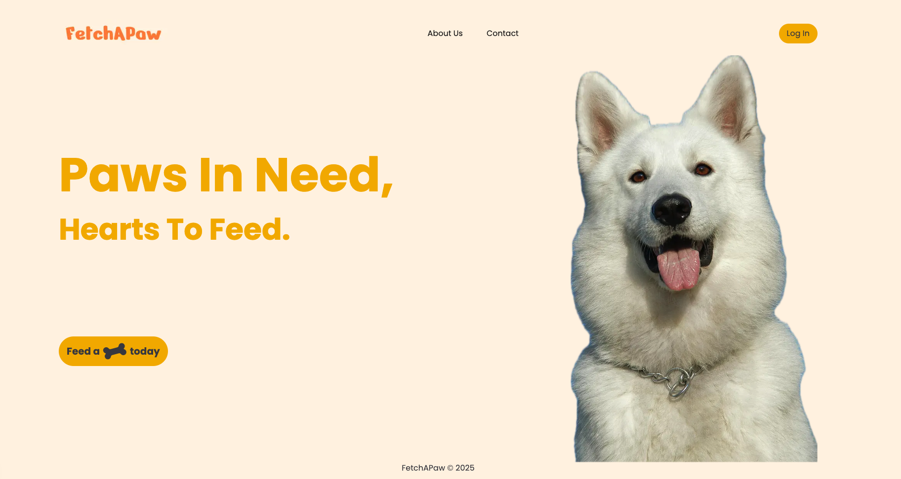

# FetchAPAW

## Overview

FetchAPAW is a web application that helps dog-lovers find their perfect furry friends.

## How to run the project

1. Clone the repository
2. Run `npm install` to install the dependencies
3. Run `npm run dev` to start the development server

## Features

1. User authentication (login, logout)
2. Search for dogs by breed, age, and location
3. Sort dogs by breed, age, and name
4. View dog profiles (name, age, breed, and more) and location on map
5. Add dogs to favorites and get a match

## Technologies Used

1. Next.js
2. Tailwind CSS
3. TypeScript
4. Shadcn UI
5. Leaflet
6. Lucide Icons

