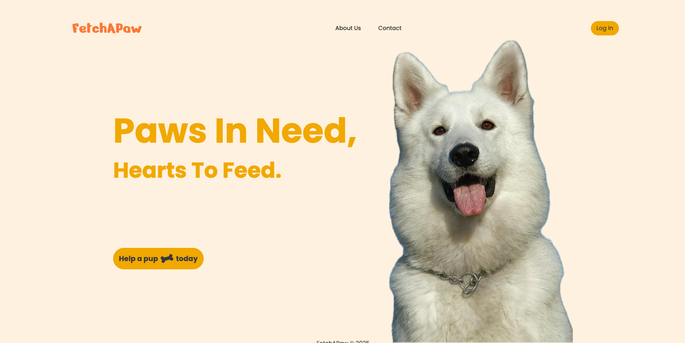

# FetchAPAW



## Overview

FetchAPAW is a web application that helps dog-lovers find their perfect furry friends.

## How to run the project

1. Clone the repository
2. Run `npm install` to install the dependencies
3. Note: API keys are not included in the repository. Please create a `.env.local` file and add the following:

    ```
    NEXT_PUBLIC_API_URL=this is the API domain
    NEXT_PUBLIC_IMAGE_SRC=this is the domain where api images are stored
    ```

4. Run `npm run dev` to start the project

## Features

1. User authentication (login, logout)


2. Search for dogs by breed, age, and location
3. Sort dogs by breed, age, and name


4. View dog profiles (name, age, breed, and more) and location on map


5. Add dogs to favorites


6. Get your pawfect furry friend match


## Technologies Used

1. Next.js
2. Tailwind CSS
3. TypeScript
4. Shadcn UI/ lucide icons
5. Leaflet
6. Lucide Icons


